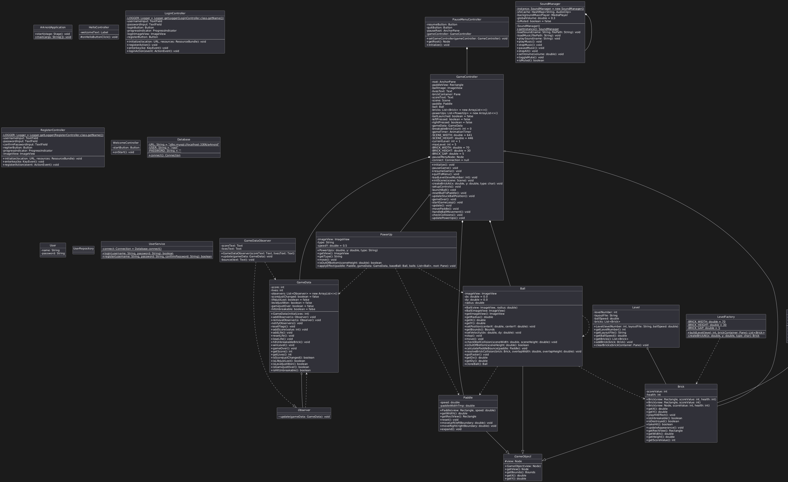

# Arkanoid Game - Object-Oriented Programming Project

## Author
Group [4] - Class [2526I_INT2204_6]
1. [Trần Phúc Khánh] - [MSSV: 24020178]
2. [Bùi Thế Trung Kiên] - [MSSV: 24020187]

**Instructor**: [Kiều Văn Tuyên - Trương Xuân Hiếu]  
**Semester**: [HK1/HK2 - 2025]

---

## Description
This is a classic Arkanoid game developed in Java as a final project for Object-Oriented Programming course. The project demonstrates the implementation of OOP principles and design patterns.

**Key features:**
1. The game is developed using Java 17+ with JavaFX for GUI.
2. Implements core OOP principles: Encapsulation, Inheritance, Polymorphism, and Abstraction.
3. Applies multiple design patterns: Singleton, Factory Method, Strategy, Observer, and State.
4. Includes sound effects, animations, and power-up systems.
5. Supports save/load game functionality and leaderboard system.
6. Features multithreading for smooth gameplay and responsive UI.

**Game mechanics:**
- Control a paddle to bounce a ball and destroy bricks
- Collect power-ups for special abilities
- Progress through multiple levels with increasing difficulty
---

## UML Diagram

### Class Diagram

## Design Patterns Implementation

### 1. Singleton Pattern
**Used in:** `SoundManager.java`

**Purpose:**: Ensure only one instance exists throughout the application.
### 2. Observer Pattern
**Used in:** `GameData.java`

**Purpose:**: The Observer Pattern is used to notify game components automatically when certain events occur (e.g., score updates, player health changes, or game state transitions) — helping keep the code modular, flexible, and decoupled.
### 3. Factory Pattern
**Used in:** `LevelFactory.java`

**Purpose:**:The Factory Pattern helps create objects without exposing the creation logic to the client. It lets you produce different types of objects using a common interface, making the code easier to maintain, extend, and modify.

---

## Multithreading Implementation

The game uses multiple threads to ensure smooth performance:

1. **Game Loop Thread**: Updates game logic at 60 FPS
2. **I/O Thread**: Handles save/load operations without blocking UI

---

## Installation

1. Clone the project from the repository.
2. Open the project in the IDE.
3. Run the project.

## Usage

### Controls
| Key | Action |
|-----|--------|
| `←`  | Move paddle left |
| `→`  | Move paddle right |
| `SPACE`| Launch ball |
| `ESC` | Pause game |
| `R` | Restart game |
| `Q` | Quit to menu |

### How to Play
1. **Start the game**: Click "Start Game" from the main menu.
2. **Control the paddle**: Use arrow keys to move left and right.
3. **Launch the ball**: Press SPACE to launch the ball from the paddle.
4. **Destroy bricks**: Bounce the ball to hit and destroy bricks.
5. **Collect power-ups**: Catch falling power-ups for special abilities.
6. **Avoid losing the ball**: Keep the ball from falling below the paddle.
7. **Complete the level**: Destroy all breakable bricks.

### Power-ups
| Icon | Name | Effect |
|------|------|--------|
| (src/main/resources/images/paddleLonger.png) | Expand Paddle | Increases paddle width for 10 seconds |
| (src/main/resources/images/addLife.png) | Add Life | You have one more live if the remaning lives less than 3|
|(src/main/resources/images/ballFaster.png) | Fast Ball | Increases ball speed by 30% |
### Scoring System
- Normal Brick: 10 points
- Strong Brick: 25 points
---

## Demo

### Screenshots

**Main Menu**  

**Gameplay**  

**Power-ups in Action**  

**Leaderboard**  

---

## Future Improvements

### Planned Features
1. **Additional game modes**
   - Time attack mode
   - Survival mode with endless levels
   - Co-op multiplayer mode

2. **Enhanced gameplay**
   - Boss battles at end of worlds
   - More power-up varieties (freeze time, shield wall, etc.)
   - Achievements system

3. **Technical improvements**
   - Migrate to LibGDX or JavaFX for better graphics
   - Add particle effects and advanced animations
   - Implement AI opponent mode
   - Add online leaderboard with database backend

---

## Technologies Used

| Technology | Version | Purpose |
|------------|---------|---------|
| Java | 17+ | Core language |
| JavaFX | 19.0.2 | GUI framework |
| Maven | 3.9.1 | Build tool |
| Jackson | 2.15.0 | JSON processing |

---

## License

This project is developed for educational purposes only.

**Academic Integrity:** This code is provided as a reference. Please follow your institution's academic integrity policies.

---

## Notes

- The game was developed as part of the Object-Oriented Programming with Java course curriculum.
- All code is written by group members with guidance from the instructor.
- Some assets (images, sounds) may be used for educational purposes under fair use.
- The project demonstrates practical application of OOP concepts and design patterns.

---

*Last updated: [11/11/2025]*
